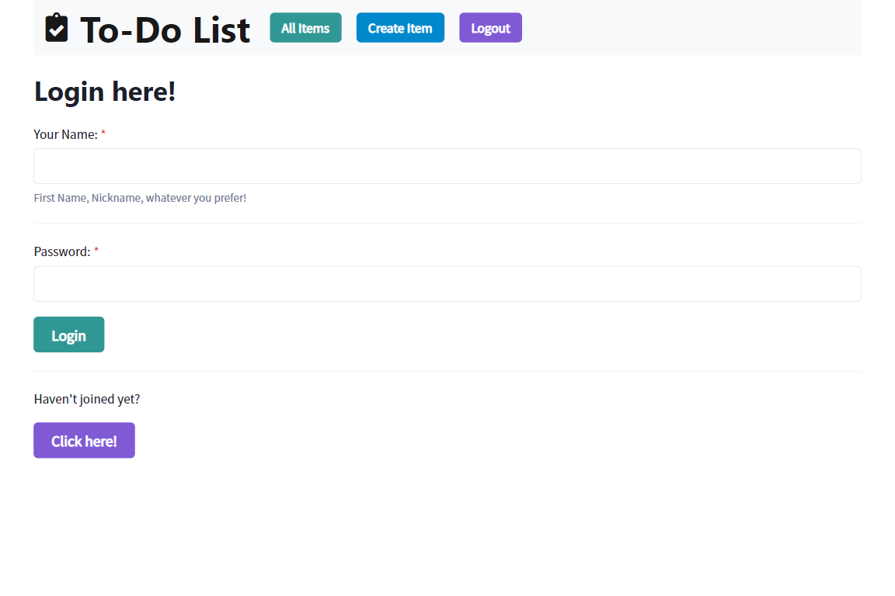
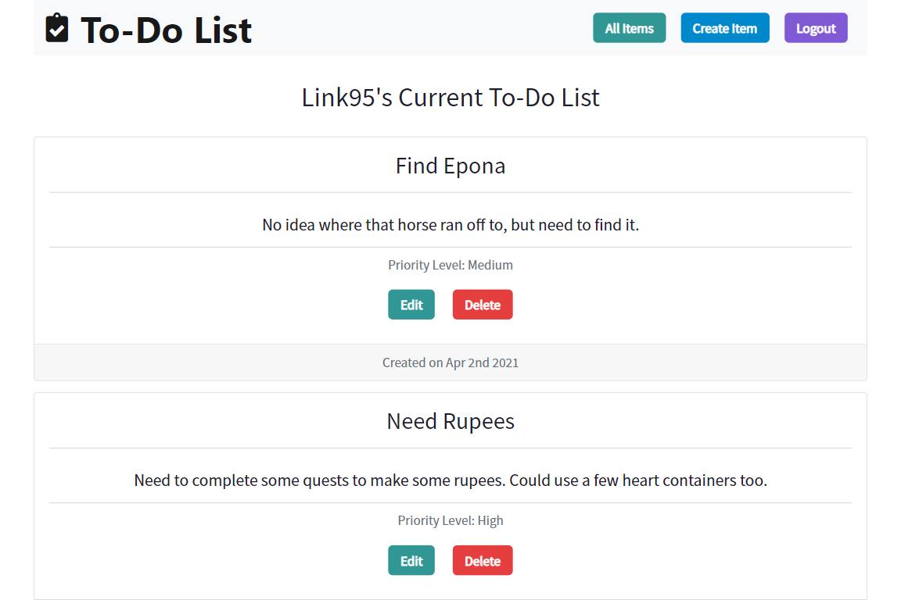
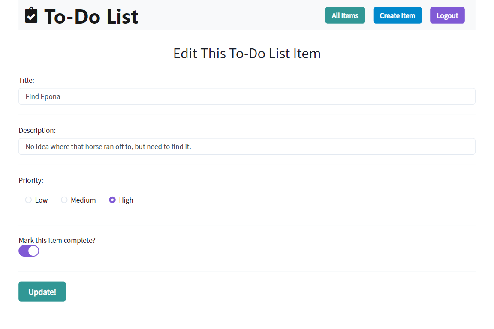

# React To-Do App

 

## Description

This is a To-Do list app to help users stay organized with tasks they need to get done. Users can signup by creating a username and password with authentication using JWTs. The user can create a to-do item, set its priority level, edit an item to update it with changes, mark an item as completed and delete items if they want to.

This is a Full-Stack MERN app using a RESTful API for interaction with the MongoDB database. React was used on the front-end along with the Chakra UI React library.
MongoDB is used for the database along with Mongoose, Express and Node.js on the back-end to create a RESTful API that the front-end interacts with.
React Context is used for state management of the app including the current user's info, their to-do items and the current to-do item when selecting a single item to edit.

## Table of Contents

-   [Technology Used](#technology-used)
-   [Screenshots](#screenshots)
-   [Contact](#contact)
-   [Links](#links)
-   [License](#license)

## Technology Used

  
  
  
  
  
  
  
  

## Screenshots

#### Sign-Up Page:

#### All To-Do Items:

#### Single Item:

## Contact

Please visit my **[GitHub profile](https://github.com/tchestnut85/)** to check out this and other projects I've created and contributed to.
Contact me at **thomaschestnut00@gmail.com** with any questions or if you'd like to collaborate.

## Links

-   **[Deployed App](https://todoapp-tc.onrender.com)**
-   **[GitHub Repo](https://github.com/tchestnut85/to-do-app)**
-   **[My Portfolio](https://tomchestnut.dev)**
-   **[Connect on LinkedIn](https://www.linkedin.com/in/thomas-chestnut)**

## License

  
This app is licensed under the MIT license.
